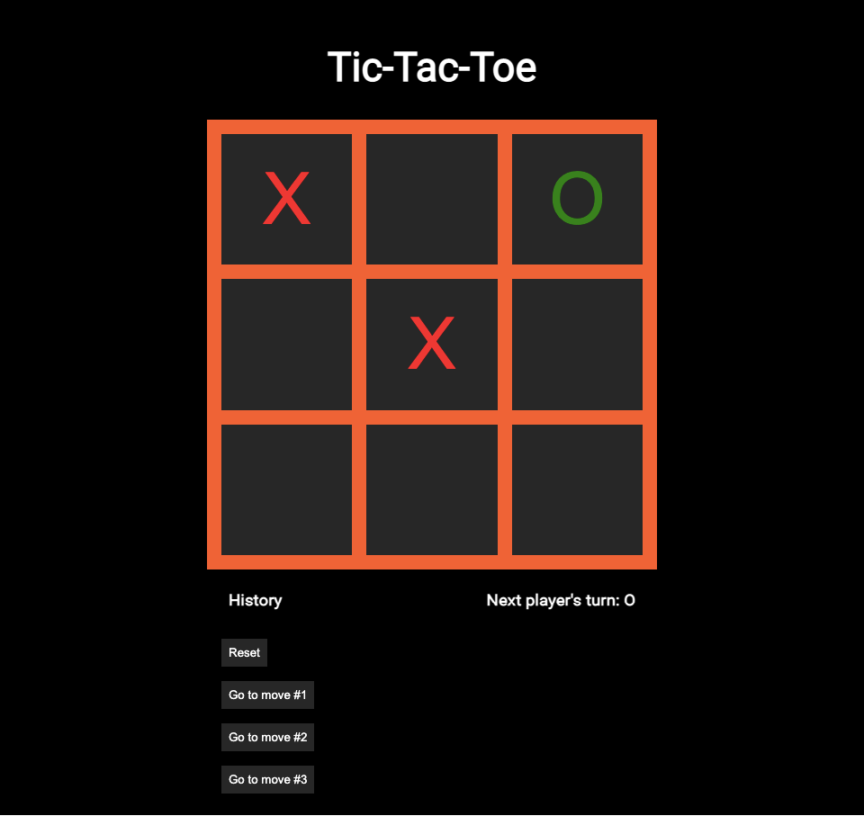

# Tic-Tac-Toe

Tic-Tac-Toe is a react game where two players seek in alternate turns to complete a row, a column, or a diagonal with either three O's or three X's drawn in the spaces of a grid of nine squares.

## Links

- [Live Demo](https://tic-tac-toe-game-client.netlify.app/)

## Screenshots

### Home Page:

## Technology

### Built with:

- React, including useState

  - Created with [create-react-app](https://github.com/facebook/create-react-app)

- JavaScript, HTML and CSS
